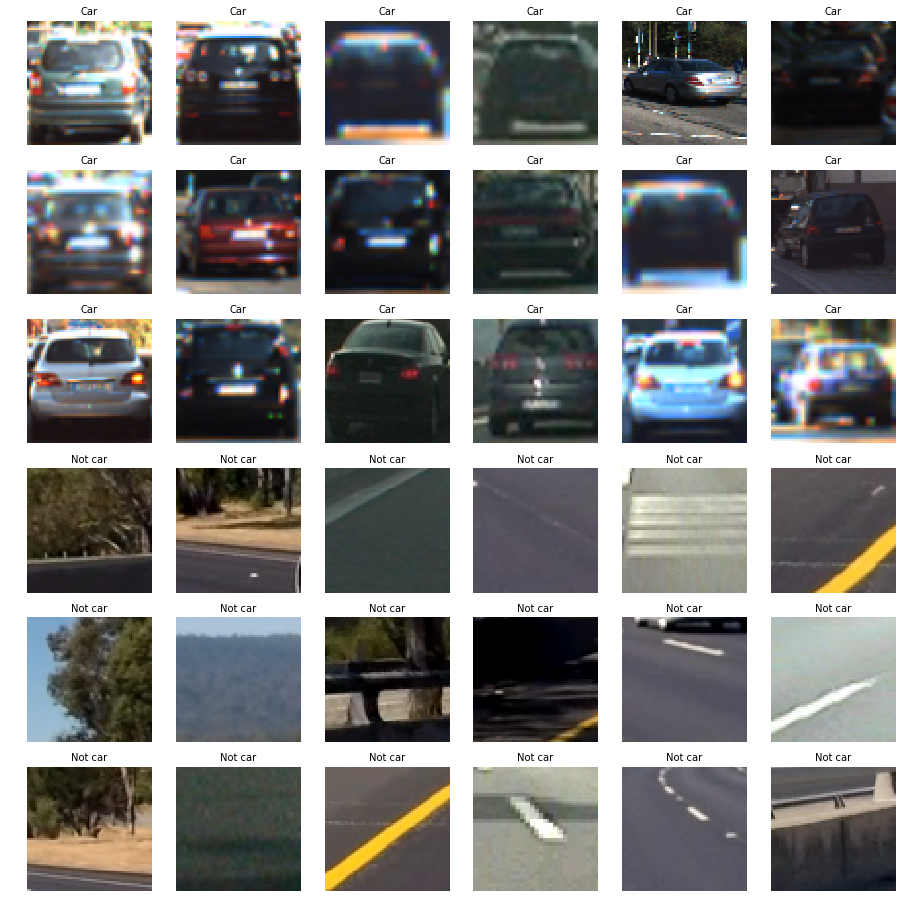
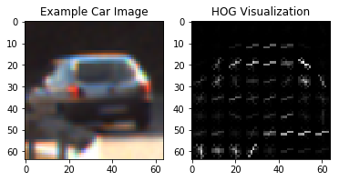
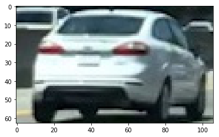
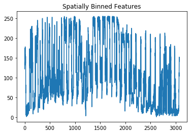
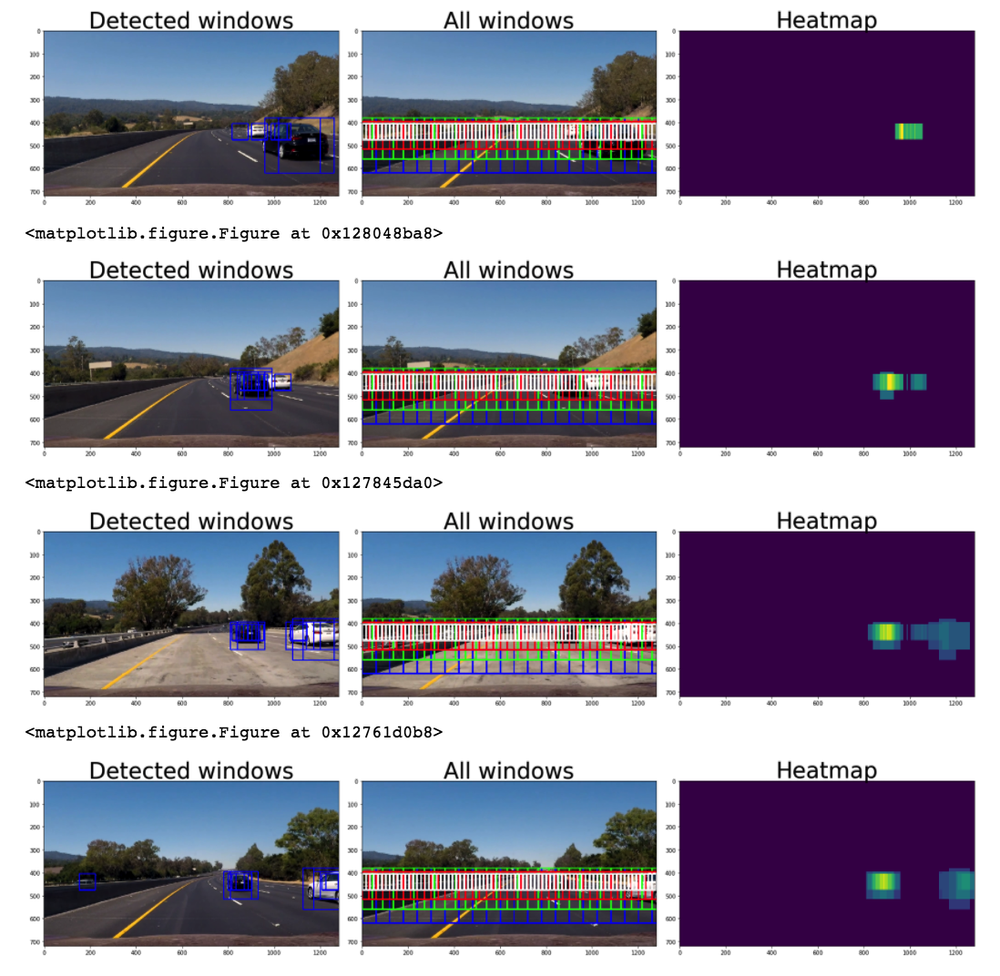
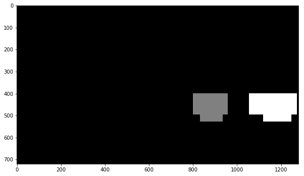
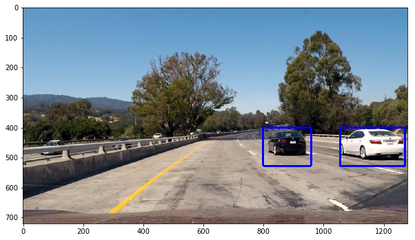

**Vehicle Detection Project**

Jay Urbain

The goals / steps of this project are the following:

* Perform a Histogram of Oriented Gradients (HOG) feature extraction on a labeled training set of images and train a classifier Linear SVM classifier
* Optionally, you can also apply a color transform and append binned color features, as well as histograms of color, to your HOG feature vector. 
* Note: for those first two steps don't forget to normalize your features and randomize a selection for training and testing.
* Implement a sliding-window technique and use your trained classifier to search for vehicles in images.
* Run your pipeline on a video stream (start with the test_video.mp4 and later implement on full project_video.mp4) and create a heat map of recurring detections frame by frame to reject outliers and follow detected vehicles.
* Estimate a bounding box for vehicles detected.

### [Rubric](https://review.udacity.com/#!/rubrics/513/view) Points

---

### Code for this project can be found in the [CarND-Vehicle-Detection.ipynb](CarND-Vehicle-Detection.ipynb) notebook. The code is in the same order as this report. 

Credits: The code relies heavily on the lesson examples from the Udacity Self-Driving course.

---

### Summary of changes from prior version:

Rewrote a significant part of my initial submission. The initial submission overfit the training data and generated some false positives. I have incorporated all of the reviewer's suggestions and more. The results are good. False positives have essentially been eliminated. Note: It does pick up some cars in the oncoming lane.

Features:  
- YUV color space, 12 orientations, 8 pixels per cell, and 2 cells per block. Identified the parameters with a feature abblation study.  
- 16x16 color spatial domain, 32 color histogram bins.  

Classification:  
- Linear SVM with C=0.0001. Identified with grid search. Performance in terms of accuracy on the validation and test sets were very close with vaues of C ranging from 0.0001 to 1.0. 

Window histogram stacking of previous windows:  
- Histogram min threshold=15 for window heatmaps. 

Updates:   
- Due to the temporal (image sequence) nature of the dataset choosing images randomly for constructing training, validation, and test sets can inadverdantly leak images in the validation and test sets into the training sets. Therefore the training (70%), validation (20%), and test (10%) sets were constructued from image sequences. Each set was then randomized.
- Added spatial binning and color histogram features. Improved accuracy on validation and test sets ~1%. Did not see a significant improvent on project video. 
- Added scaling of feature vectors due to the addition of color histograms and spatical binning.    
- Based on an abblation study using the new dataset, HLS colorspace had higher accuracy on new dataset.  The original parameters of YUV, 9 orientations, 8 pixels per cell, and 2 cells per block underformed HLS, 9 orientations, 8 pixels per cell, and 2 cells for over 2% on validation data with the new dataset. However the HLS colorspace had higher false positives on the test video, so I switched back to YUV.
- Using a HOG filter with 9 or 12 orientations worked about the same. pixels_per_cell of 8 or 16 worked about the same. Other optimization techniques that proved helpful included the heatmap and heatmap threshold.
- Used GridSearchCV() to identify C=0.0001 for a smoother, more generalizable decision boundary.   
- Added bounding box class to implement a queue for generating heat map. Requireds 15 for video.  
- Increased the window overlap for sliding windows search from 50% to 75% to eliminate false negatives.  

---
### Data Exploration

Under the sections **Load Data** and **Visualize Data**, the first step was to load and explore the dataset for both *car* and *not car* classes. Sample images are shown below.

Labeled images were taken from the project defined GTI vehicle image database [GTI](http://www.gti.ssr.upm.es/data/Vehicle_database.html), the [KITTI](http://www.cvlibs.net/datasets/kitti/) and the vision benchmark suite, and the project video.

All images are 64x64 pixels. 

In total there are 8792 images of vehicles and 9666 images of non vehicles. So the dataset is relatively balanced.

Below are sample images of *car* and *not car* images: 

Due to the temporal (image sequence) nature of the dataset choosing images randomly for constructing training, validation, and test sets can inadverdantly leak images in the validation and test sets into the training sets. Therefore the training (70%), validation (20%), and test (10%) sets were constructued from images sequences. Then each set was randomized as follows:  

[ 583  293  636  464 4176 6277] [ 750  377  818  597 5369 8071]  
Number of samples in cars training set:  6152  
Number of samples in notcars training set:  6277  
Number of samples in cars validation set:  1759  
Number of samples in notcars validation set:  1794  
Number of samples in cars test set:  881  
Number of samples in notcars test set:  897  
car_image.shape (64, 64, 3)  

This technique required to data to be "re-joined" for proper scaling, and then "re-separated.""

### Histogram of Oriented Gradients (HOG)

#### 1. Explain how (and identify where in your code) you extracted HOG features from the training images.

HOG visualization is a representation that shows the dominant gradient direction within each cell with brightness corresponding to the strength of gradients in that cell.

References:  

<a href="http://scikit-image.org/">http://scikit-image.org/</a>

<a href="http://scikit-image.org/docs/dev/api/skimage.feature.html?highlight=feature%20hog#skimage.feature.hog">http://scikit-image.org/docs/dev/api/skimage.feature.html?highlight=feature%20hog#skimage.feature.hog</a>

<a href="http://scikit-image.org/docs/dev/auto_examples/features_detection/plot_hog.html">http://scikit-image.org/docs/dev/auto_examples/features_detection/plot_hog.html</a>

Here is an example using a grayscale image and HOG parameters of `orientations=8`, `pixels_per_cell=(8, 8)` and `cells_per_block=(2, 2)`:

### Optionally, you can also apply a color transform and append binned color features, as well as histograms of color, to your HOG feature vector. 

- Added color histogram and binned features.     

- Added scaling of feature vectors due to the addition of color histograms and binned features.   

The images below show the car and its spaitally binned color features for an **RGB** colorspace:   

The functions **single_img_features()** takes an image with specifications for: 
img,  
color_space, # (RGB, HSV, etc.),  
spatial_size #for spatial binning,  
hist_bins #for color histogram, 
orient, pix_per_cell, cell_per_block, hog_channel, # for HOG
spatial_feat=True, hist_feat=True, hog_feat=True) # booleans for features

The function **get_features()** process multipleimages by calling **single_img_features()**.

These functions replace **extract_features()**.

An abblation study of HOG parameters and color spaces using a Linear SVM classifier was used to determine optimal parameters for color spaces and hog parameters. See section 3 below.

#### 2. Explain how you settled on your final choice of HOG parameters.

Under the section **Perform feature ablation study**, an abblation study of HOG parameters and color spaces using a Linear SVM classifier was used to determine optimal parameters for color spaces and hog parameters. See section 3 below.

#### 3. Describe how (and identify where in your code) you trained a classifier using your selected HOG features (and color features if you used them).

Under the section **Create and evaluate an SVM classifier using HOG, color histogram and color spatial parameters** an SVM classifier was created.  

Shown below is the output of the final parameters. LinearSVC() was parameterized with **svc = LinearSVC(C=0.0001)** after running sklearn **GridSearchCV()**. A RBF kernel was also selected, this kernel would not converge unless I reduced the dimensionality of the model.

Using: 9 orientations 8 pixels per cell and 2 cells per block  
Feature vector length: 6156  
2.52 Seconds to train SVC...  
Validation Accuracy of SVC =  0.9783  
Test Accuracy of SVC =  0.9533  
0.00895 Seconds to predict 100 labels with SVC  

### Sliding Window Search

#### 1. Describe how (and identify where in your code) you implemented a sliding window search.  How did you decide what scales to search and how much to overlap windows?

In the section: **Method for Using Classifier to Detect Cars in an Image**

Methods were defined for:  
- draw_boxes() - draws bounding box on image  
- search_windows() - extracts features and runs prediction model for each window in a list of windows.
- slide_window() - takes an image, start and stop positions (x and y), window size (x and y dimensions), and overlap fraction (75%) and identifies the position of each window to search.
- search_all_scales() - uses slide_window() and search_window() to searche across all scaled windows (240,180,120,70) and returns predictions.       

To reduce false positives, a BoundingBoxes class was created to maintain a queue of window predictions. This class is used to implement a heatmap and a minimum threshold of overlapping windows, i.e., heatmaps. A threshold of 15 was used for the project video.

Heatmap images are labeled using **scipy.ndimage.measurement.label** as shown in the image below:

Finally, bounding boxes are drawn on the the labeled images as shown in the image below:

#### 2. Show some examples of test images to demonstrate how your pipeline is working.  What did you do to optimize the performance of your classifier?

See images above.

Performance was improved using an incremental, iterative approach. 

- Due to the temporal (image sequence) nature of the dataset choosing images randomly for constructing training, validation, and test sets can inadverdantly leak images in the validation and test sets into the training sets. Therefore the training (70%), validation (20%), and test (10%) sets were constructued from image sequences. Each set was then randomized.
- Added spatial binning and color histogram features. Improved accuracy on validation and test sets ~1%. Did not see a significant improvent on project video. 
- Added scaling of feature vectors due to the addition of color histograms and spatical binning.    
- Based on an abblation study using the new dataset, HLS colorspace had higher accuracy on new dataset.  The original parameters of YUV, 9 orientations, 8 pixels per cell, and 2 cells per block underformed HLS, 9 orientations, 8 pixels per cell, and 2 cells for over 2% on validation data with the new dataset. However the HLS colorspace had higher false positives on the test video, so I switched back to YUV.
- Using a HOG filter with 9 or 12 orientations worked about the same. pixels_per_cell of 8 or 16 worked about the same. Other optimization techniques that proved helpful included the heatmap and heatmap threshold.
- Used GridSearchCV() to identify C=0.0001 for a smoother, more generalizable decision boundary.   
- Added bounding box class to implement a queue for generating heat map. Requireds 15 for video.  
- Increased the window overlap for sliding windows search from 50% to 75% to eliminate false negatives.  

Improvements:  
- The single best improvement would be to include more labeled taken from image data more similar to the road conditions.
- I wold like to try a conv net.

---

### Video Implementation

#### 1. Provide a link to your final video output.  Your pipeline should perform reasonably well on the entire project video (somewhat wobbly or unstable bounding boxes are ok as long as you are identifying the vehicles most of the time with minimal false positives.)

Here's a link to my video result: [project_video_out.mp4](project_video_out.mp4)

#### 2. Describe how (and identify where in your code) you implemented some kind of filter for false positives and some method for combining overlapping bounding boxes.

See above section "Show some examples of test images".

---

### Discussion

#### 1. Briefly discuss any problems / issues you faced in your implementation of this project.  Where will your pipeline likely fail?  What could you do to make it more robust?

The largest issue I ran into was related to learning the API's and their effects on the data. 

