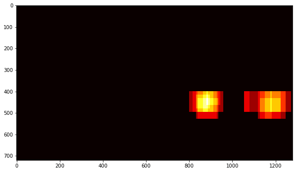

**Vehicle Detection Project**

The goals / steps of this project are the following:

* Perform a Histogram of Oriented Gradients (HOG) feature extraction on a labeled training set of images and train a classifier Linear SVM classifier
* Optionally, you can also apply a color transform and append binned color features, as well as histograms of color, to your HOG feature vector. 
* Note: for those first two steps don't forget to normalize your features and randomize a selection for training and testing.
* Implement a sliding-window technique and use your trained classifier to search for vehicles in images.
* Run your pipeline on a video stream (start with the test_video.mp4 and later implement on full project_video.mp4) and create a heat map of recurring detections frame by frame to reject outliers and follow detected vehicles.
* Estimate a bounding box for vehicles detected.

## [Rubric](https://review.udacity.com/#!/rubrics/513/view) Points

** Final code for this project can be found in the following notbook:  

[notebook](CarND-Vehicle-Detection.ipynb). Code is in the same order as this report. 

The code relies heavily on the lesson examples from the Udacity Self-Driving course.

---

### Histogram of Oriented Gradients (HOG)

#### 1. Explain how (and identify where in your code) you extracted HOG features from the training images.

Under the sections **Load Data** and **Visualize Data**, the first step was to load and explore the dataset for both *car* and *not car* classes. Sample images are shown below.

HOG visualization is a representation that shows the dominant gradient direction within each cell with brightness corresponding to the strength of gradients in that cell.

References:  

<a href="http://scikit-image.org/">http://scikit-image.org/</a>

<a href="http://scikit-image.org/docs/dev/api/skimage.feature.html?highlight=feature%20hog#skimage.feature.hog">http://scikit-image.org/docs/dev/api/skimage.feature.html?highlight=feature%20hog#skimage.feature.hog</a>

<a href="http://scikit-image.org/docs/dev/auto_examples/features_detection/plot_hog.html">http://scikit-image.org/docs/dev/auto_examples/features_detection/plot_hog.html</a>

Here is an example using the `RGB` color space and HOG parameters of `orientations=8`, `pixels_per_cell=(8, 8)` and `cells_per_block=(2, 2)`:

The function **extract_features()** takes an image with specifications for orientations, pixels_per_cell, and cells_per_block, as well as flags set for whether or not you want the feature vector unrolled and/or a visualization image. The pixels per cell are normalized over the cells per block.

An abblation study of permutations of HOG parameters and color spaces using a Linear SVM classifier was used to empirically determine parameters for color spaces and hog parameters. See section 3 below.

#### 2. Explain how you settled on your final choice of HOG parameters.

An abblation study of permutations of HOG parameters and color spaces using a Linear SVM classifier was used to empirically determine parameters for color spaces and hog parameters. See section 3 below.

#### 3. Describe how (and identify where in your code) you trained a classifier using your selected HOG features (and color features if you used them).

Under the section **Create and evaluate an SVM classifier with default HOG parameters and an RGB color space**, a Linear SVM classifier function using sklearn.svm.LinearSVC) can be found in *trainSVM(X_train, y_train, n_predict=10)*

Initially the classifier was trained with the following parameters:  
colorspace = 'RGB' # Can be RGB, HSV, LUV, HLS, YUV, YCrCb  
orient = 9  
pix_per_cell = 8  
cell_per_block = 2  
hog_channel = 0 # Can be 0, 1, 2, or "ALL"

Output:  

`
52.52 Seconds to extract HOG features...
Using: 9 orientations 8 pixels per cell and 2 cells per block
Feature vector length: 1764
`

Optimal HOG and color space parameters were determined using an abblation study consisting of all permutations of the following parameters when trained on a Linear SVM classifier:

colorspaces = ['RGB', 'HSV', 'HLS', 'YUV', 'YCrCb']  
hog_channels = [0, 1, 2,'ALL']  
orientations = [6, 9, 12]  
pixels_per_cell = [4, 8, 16]  
cell_per_block = [2, 4, 8]  

Sample output of some of the top performing models:  

***  
Colorspace HSV HOG Channel ALL  
118.69 Seconds to extract HOG features...  
Using: 12 orientations 8 pixels per cell and 2 cells per block  
Feature vector length: 7056  
5.34 Seconds to train SVC...  
Test Accuracy of SVC =  0.9845  
My SVC predicts:  [ 0.  1.  0.  0.  1.  1.  0.  1.  1.  0.]  
For these 10 labels:  [ 0.  1.  0.  0.  1.  1.  0.  1.  1.  0.]  
0.00174 Seconds to predict 10 labels with SVC  

HSV and YUV colorspaces using 'ALL' channels worked about the same.  

Using 9 or 12 orientations worked about the same.  

...  

***  
Colorspace YUV HOG Channel ALL  
117.14 Seconds to extract HOG features...  
Using: 9 orientations 8 pixels per cell and 2 cells per block  
Feature vector length: 5292  
6.62 Seconds to train SVC...  
Test Accuracy of SVC =  0.9834  
My SVC predicts:  [ 0.  1.  0.  0.  1.  0.  0.  1.  0.  0.]  
For these 10 labels:  [ 0.  1.  0.  0.  1.  0.  0.  1.  0.  0.]  
0.00181 Seconds to predict 10 labels with SVC  

...  

***  
Colorspace YUV HOG Channel ALL  
123.2 Seconds to extract HOG features...  
Using: 12 orientations 8 pixels per cell and 2 cells per block  
Feature vector length: 7056  
6.61 Seconds to train SVC...  
Test Accuracy of SVC =  0.9862  
My SVC predicts:  [ 0.  0.  0.  1.  1.  1.  1.  0.  0.  0.]  
For these 10 labels:  [ 0.  0.  0.  1.  1.  1.  1.  0.  0.  0.]  
0.00163 Seconds to predict 10 labels with SVC  

From the top performing models, the following model was selected.  *YUV* was selected over *HSV* due to its better performance on the "Advanced lane find project." 

colorspace = 'YUV'  
orient = 9  
pix_per_cell = 8  
cell_per_block = 2  
hog_channel = 'ALL'  

### Sliding Window Search

#### 1. Describe how (and identify where in your code) you implemented a sliding window search.  How did you decide what scales to search and how much to overlap windows?

In the section: **find_cars method to detect cars in images**, the **find_cars()** function combines HOG feature extraction with a sliding window search. To improve performance, HOG features are extracted for the entire image or a selected portion of the image. These features are subsampled according to the size of the window fed to the classifier. 

The function performs prediction on the HOG features for each window region and returns a list of rectangle objects corresponding to the windows that generated a positive car predictions.

The image below shows the use of **find_cars** on a test image.  

Several window scale sizes of 1.0x, 1.5x, 2.0x, and 3.0x windows are evaluated as shown in the image below. Different windows sizes use different colors. Windows of size < 1.5x appeared to generate the most false-positives.

The image below shows the final p**find_cars()** function output. 

To better eliminate false positives, a heatmap was generated using the function **add_heat()**. The function increments a pixel count for each overlapping window as shown in the test image below:

By adding a minimum threshold, additional false positives can be removed. Note how lighter heat images are removed (left) from the previous heatmap (above).

Heatmap images are labeled using **scipy.ndimage.measurement.label** as shown in the image below:

Finally, bounding boxes are drawn on the the labeled images as shown in the image below:

#### 2. Show some examples of test images to demonstrate how your pipeline is working.  What did you do to optimize the performance of your classifier?

Under the section **Integrate processing**, the **process_image()** function integrates processing for a single image frame. The image below shows processing for all test images.

Performance was improved using an incremental, iterative approach. It took me a long time to get there. The abblation study described above helped me quickly identify the appropriate color space and HOG parameters. Using the **YUV** color space and all color channels signficantly improved performance. 

Using a HOG filter > 6, i.e, 9 or 12 worked about the same. pixels_per_cell of 8 or 16 worked about the same. Other optimization techniques that proved helpful included the heatmap and heatmap threshold.

---

### Video Implementation

#### 1. Provide a link to your final video output.  Your pipeline should perform reasonably well on the entire project video (somewhat wobbly or unstable bounding boxes are ok as long as you are identifying the vehicles most of the time with minimal false positives.)

Here's a [link to my video result](./project_video_out.mp4)

#### 2. Describe how (and identify where in your code) you implemented some kind of filter for false positives and some method for combining overlapping bounding boxes.

See above section ("Show some examples of test images").

---

### Discussion

#### 1. Briefly discuss any problems / issues you faced in your implementation of this project.  Where will your pipeline likely fail?  What could you do to make it more robust?

Here I'll talk about the approach I took, what techniques I used, what worked and why, where the pipeline might fail and how I might improve it if I were going to pursue this project further.  

